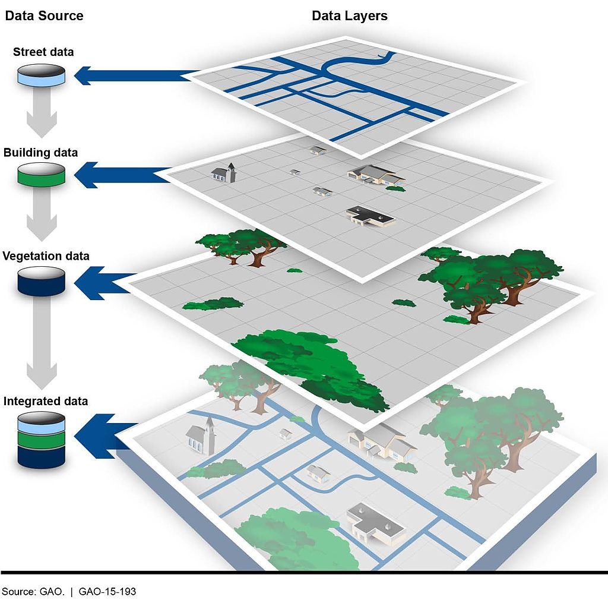

```{r setup, include=FALSE}
knitr::opts_chunk$set(echo = TRUE)
```

## Chapter 23

Up to now, we've been looking at patterns in data for what is more than this, or what's the middle look like. We've calculated metrics like per capita rates, or looked at how data changes over time.

Another way we can look at the data is geographically. Is there a spatial pattern to our data? Can we learn anything by using distance as a metric? What if we merge non-geographic data into geographic data?

The bad news is that there isn't a One Library To Rule Them All when it comes to geo queries in R. But there's one emerging, called Simple Features, that is very good.

Go to the console and install it with `install.packages("sf")`

To understand geographic queries, you have to get a few things in your head first:

1.  Your query is using planar space. Usually that's some kind of projection of the world. If you're lucky, your data is projected, and the software will handle projection differences under the hood without you knowing anything about it.
2.  Projections are cartographers making opinionated decisions about what the world should look like when you take a spheroid -- the earth isn't perfectly round -- and flatten it. Believe it or not, every state in the US has their own geographic projection. There's dozens upon dozens of them.
3.  Geographic queries work in layers. In most geographic applications, you'll have multiple layers. You'll have a boundary file, and a river file, and a road file, and a flood file and combined together they make the map. But you have to think in layers.
4.  See 1. With layers, they're all joined together by the planar space. So you don't need to join one to the other like we did earlier -- the space has done that. So you can query how many X are within the boundaries on layer Y. And it's the plane that holds them together.

```{r, echo=FALSE}

```

## Importing and viewing data

Let's start with the absolute basics of geographic data: loading and viewing. Load libraries as usual.

### Task 1: Load packages

**Task** Run the following code to load packages.

```{r}
library(tidyverse)
library(sf)
library(janitor)
```

First: an aside on geographic data. There are many formats for geographic data, but data type you'll see the most is called the shapefile. It comes from a company named ERSI, which created the most widely used GIS software in the world. For years, they were the only game in town, really, and the shapefile became ubiquitous, especially so in government and utilities.

So more often than not, you'll be dealing with a shapefile. But a shapefile isn't just a single file -- it's a collection of files that combined make up all the data that allow you to use it. There's a .shp file -- that's the main file that pulls it all together -- but it's important to note if your shapefiles has a .prj file, which indicates that the projection is specified.

You also might be working with a GeoDatabase, or a .gdb file. That's a slightly different, more compact version of a Shapefile.

The data we're going to be working with is a GeoDatabase from the [Prince George's County Department of Planning](https://gisdata.pgplanning.org/opendata/) that contains information about the county's election precincts.

### Task: Load the Prince George's County election precinct data.

Simlar to `readr`, the `sf` library has functions to read geographic data. In this case, we're going to use `st_read` to read in our precinct data. And then glimpse it to look at the columns.

### Task: Load data

**Task** Run the following code to load data. Describe what you see in the answer space below. What columns exist in this data? 

**Answer** This code reveals data pertaining to election precincts existing within Prince George's County, Maryland. This data also tells us a multitude of other things such as what projection they are using which in this case is the Maryland projection. Information is included regarding the various election districts and their boundaries, with each record representing a specific precinct. There are 10 columns within this data... PRECINCT_ID, PRECINCT_NAME, CONGRESS, LEGIS, COUNCIL, SCHOOL, POLLING_ID, Shape_Length, Shape_Area, and Shape. 

```{r}
pg_precincts <- st_read("data/Election_Precinct_2022_Py.gdb")

glimpse(pg_precincts)
```

This looks like a normal dataframe, and mostly it is. We have one row per precinct, and each column is some feature of that precinct: the ID, name and more. What sets this data apart from other dataframes we've used is the last column, "Shape", which is of a new data type. It's not a character or a number, it's a "Multipolygon", which is composed of multiple longitude and latitude values. When we plot these on a grid of latitude and longitude, it will draw those shapes on a map.

Let's look at these precincts. We have 356 of them, according to this data.

### Task: Run code

**Task** Run the following code. Describe the output in the space below: what kind of information does it contain? 

**Answer** The View(pg_precincts) function opens the pg_precincts dataset in spreadsheet style, providing us with a more detailed look at the data. This dataset contains info related to election precincts in Prince George's County, Maryland... including identifiers for various election districts and polling place information. The last column of this dataset is labeled "Shape" and it is what makes mapping and visualizing the precinct boundaries on a map possible by holding the spatial data for each precinct in the form of different geometries and in this case, polygons.

```{r}
View(pg_precincts)
```

But where in Prince George's County are these places? We can simply plot them on a longitude-latitude grid using ggplot and geom_sf.

### Task: Run code

**Task** Run the following code. Describe the output in the space below. 

**Answer** After running the following code the output that I receive is a collection fo the boundaries of the precincts within Prince George's County. The map is on a grid that shows the longitudes and latitudes. The precincts that are white are the precincts known as "ghost precincts" these are not residential land meaning they could be parks or agricultural land, or something else but their is no voting location in them. This is a good base map in that it shows us where the precincts are but not much beyond that. That being said, though the map does provide a clear visual representation of the precincts' boundaries, it is lacking additional geographic context that are important when it comes to truly interpreting the map. 

```{r}
pg_precincts |>
  ggplot() +
  geom_sf() +
  theme_minimal()
```

Each shape is a precinct, with the boundaries plotted according to its degrees of longitude and latitude.

If you know anything about Prince George's, you can kinda pick out the geographic context here. To the west is the District of Columbia, for example. College Park is near the top. But this map is not exactly ideal. It would help to have a state and county map layered underneath of it, to help make sense of the spatial nature of this data.

This is where layering becomes more clear. First, we want to go out and get another shapefile, this one showing Maryland county outlines.

Instead of loading it from our local machine, like we did above, we're going to use a package to directly download it from the U.S. Census. The package is called `tigris` and it's developed by the same person who made `tidycensus`.

In the console, install tigris with `install.packages('tigris')`

Then load it:

### Task: Run code

**Task** Run the following code. Describe the output in the space below. 

**Answer** The tigris package has been successfully installed and  loaded into the R environment. Upon its installation a message is returned that reads, "To enable caching of data, set `options(tigris_use_cache = TRUE)`in your R script or .Rprofile." Tigris is a package that is specifically designed to provide access to U.S. Census Bureau geographic data.

```{r}
# install.packages('tigris')
library(tigris)
```

Now, let's use the counties() function from tigris to pull down a shapefile of all U.S. counties.

### Task: Run code

**Task** Run the following code. Describe the output in the space below. 

**Answer** The output of the following code provides us with data on all of the counties within America. There are 18 total columns that display a number of different pieces of information about counties including their land area and water area. The counties() function from the tigris package works to download a shapefile that contains data about all of the counties within the United States. To go more in depth, this shapefile contains data for a total of 3,233 counties across the U.S. and its territories, in the form of an sf object which as we learned in class is a spatial data format that utilizes both tabular data as well as spatial geometry.

```{r}

counties <- counties()

glimpse(counties)
```

This looks pretty similar to our places shapefile, in that it looked mostly like a normal dataframe with the exception of the new geometry column (this time called `geometry`, which is pretty common).

This county shapefile has all 3233 U.S. counties. We only want the Maryland counties, so we're going to filter the data to only keep Maryland counties. There is no STATE column, but there is a STATEFP column, with each number representing a state. Maryland's FP number is 24.

### Task: Run code

**Task** Run the following code. Describe the output in the space below. 

**Answer** This code has reduced the former code to only include data on counties within the state of Maryland. In other words, it is filtering the counties dataset, which contains data for every single county in the U.S., to keep only the counties that exist within the state of Maryland. The output is ultimately producing a new dataset called "md_counties", containing only  rows corresponding to MD counties. Despite maintaining the same structure/organization as the original dataset, with the identical 18 columns, it is now limited to only the 24 counties located in Maryland.

```{r}
md_counties <- counties |>
  filter(STATEFP == "24")
```

To see what this looks like, let's plot it out with ggplot. We can pretty clearly see the shapes of Maryland counties.

### Task: Run code

**Task** Run the following code. Describe the output in the space below. 

**Answer** This is a county map of Maryland. We see the entire state of Maryland with lines separating the different counties (24) that exist within the area of the state. This code is using ggplot2 and the geom_sf() function to plot this sf object. In terms of the purpose of this output and what it is truly showing, this map provides a very clear visual representation of the spatial distribution of all 24 counties within Maryland.

```{r}
md_counties |>
  ggplot() +
  geom_sf() +
  theme_minimal()
```

With this county map, we can layer our places data. We'll narrow it down to just Prince George's County to get an outline.

Something to note: The layers are rendered in the order they appear. So the first geom_sf is rendered first. The second geom_sf is rendered ON TOP OF the first one.

We're also going to change things up a bit to put the datasets we want to display INSIDE of the geom_sf() function, instead of starting with a dataframe. We have two to plot now, so it's easier this way.

### Task: Run code

**Task** Run the following code. Describe the output in the space below. 

**Answer** This output takes the county and county lines that we created in the former codeblock and focuses it on a singular county within Maryland, Prince George's County. As you can see in the code itself, the base layer goes first and then the more detailed aspects goes on top of it. This updated map is different than the previous map in that it focuses only on Prince George's County in Maryland, showing both the boundary of Prince George's County as the base layer and the precinct boundaries within PG county, overlapping on top of the county map. This aspect of layering allows us to clearly differentiate between the larger geographical region which is the county itself and the smaller confined regions which are the precincts. I would describe this map as minimalist and polished as it puts a great emphasis on the location based/spatial relationships between PG County and the precincts that lie within. 

```{r}
ggplot() +
  geom_sf(data=md_counties |> filter(COUNTYFP == "033")) +
  geom_sf(data=pg_precincts) +
  theme_minimal()
```

Notice the subtle differences at the boundaries?

Let's dive back into Prince George's precincts and see what more we can find out about them. It would be useful to know, for example, what turnout was like for the July primary election. We can use [the state's data](<https://elections.maryland.gov/press_room/2024_stats/Official%20by%20Party%20and%20Precinct.csv> to determine this.

### Task: Run code to load the turnout data from the May 2024 Primary election

**Task** Run the following code. Describe the output in the space below. 

**Answer** The output of this codeblock is a summary table titled pg_turnout that presents voter turnout data for Prince George's County precincts specific to the primary election held in May of 2024. For each precinct this dataset contain information for the total # of voters that chose to vote at polling places, early, absentee, and provisionally. It also reveals the total number of eligible voters in each precinct. In terms of what stands out to me about this output, I find that this dataset really demonstrates the differences in the participation of PG County voters across the precincts. You can not only now analyze trends regarding voter turnout but you can also compare voting methods and make data backed assumptions about the voter engagement based performance of different precincts. 

```{r}
primary_24 <- read_csv("data/Official by Party and Precinct.csv") |> clean_names()
pg_turnout <- primary_24 |> 
  filter(lbe == "Prince George's") |> 
  group_by(precinct) |> 
  summarise(total_polls = sum(polls), total_early = sum(early_voing), total_absentee = sum(absentee), total_provisional = sum(provisional), total_eligible = sum(eligible_voters))

View(pg_turnout)
```

Now we can join the precincts to the turnout data.

### Task: Run code to join the precinct shapes with the voter turnout data

**Task** Run the following code. Describe the output in the space below. 

**Answer** In this codeblock we are joining the datasets "pg_precincts" to the pg_turnout. This ultimately produced a new dataframe that contains both the precincts and the turnout. The output reflects the fact that pg_precincts contains the geographic shapes of the precincts in PG County and that pg_turnout contains voter turnout data for these precincts in the primary election of 2024. The resulting dataset which is titled pg_precincts_with_turnout, contains both the geographic boundary data of PG County precincts as well as turnout data for each of the precincts...

```{r}
pg_precincts_with_turnout <- pg_precincts |> left_join(pg_turnout, by=c("PRECINCT_ID"="precinct"))
```

Now we can use color to distinguish precincts from each other. Let's use the total eligible voters to start with:

### Task: Run code

**Task** Run the following code. Describe the output in the space below. 

**Answer** This updated code is allowing us to take that combined data frame that contains both precincts and turnout and use color to distinguish turnouts from each other. Now we can clearly identify our "ghost precincts" which are the precincts in white that contains no eligible voters. We can see that across the county there is a large variation among the number of eligible voters per precinct and that their are some rather substantial ones located in the middle. This map uses is the first map we have seen in this prelab that uses color gradients to represent the # of eligible voters in each precinct of PG County. This incorporation of color allows us to easily identify ghost precincts which are white and represent no eligible voters, precincts with larger populations, and precincts with fewer voters. In doing all of this, this map works well at highlighting the location based variation in the number of eligible voters across the county. 

```{r}
ggplot() +
  geom_sf(data=pg_precincts_with_turnout, aes(fill=total_eligible)) +
  scale_colour_viridis_b(option="magma") +
  theme_minimal()
```

With these changes, what else can we make out here? First, you can pretty easily spot our "ghost precincts" - they are the ones in white, where there are no eligible voters. But you also can see that there's some pretty big variation among the number of eligible voters per precinct across the county, with some very large ones in the middle.

## Chapter 24

In the previous chapter, we looked at election precincts in Prince George's County to show a bit of a pattern regarding concentration of the precincts with the most and 0 eligible voters. Let's go little further and look at voters statewide.

First, let's load the libraries we'll need. We're also going to load tidycensus and set an API key for tidycensus.

### Task: Load libraries

**Task** Run the following code.

```{r}
library(tidyverse)
library(sf)
library(janitor)
library(tidycensus)
```

For the rest of this chapter, we're going to work on building a map that will help us gain insight into geographic patterns in voter registration by county in Maryland. Our question: by examining the number of Democrats/Republicans/Unaffiliated voters per 10,000 people in each county, what regional geographic patterns can we identify?

We've got voters by county, so let's load that from the data folder and take a look:

### Task: Run code

**Task** Run the following code. Describe the output in the space below. 

**Answer** This codeblock reads the voter data from a CSV file named eligible_voters.csv. The output we are seeing is a result of the data being arranged in descending order based on the total number of eligible voters across Maryland's counties. It is a sorted list of Maryland counties based on the total number of eligible voters in county. We are able to see which counties have the highest voter populations and is a very useful tool when it comes time to pick out or identify specific regions of particular interest when analyzing voter registration patterns.

```{r}
voters_by_county <- read_csv("data/eligible_voters.csv")

voters_by_county |> arrange(desc(TOTAL))
```

So, what do we see here? Montgomery County has the most, followed by Prince George's & Baltimore County. Checks out.

Next, we'll go out and get population data for each county from tidycensus. The variable for total population is B01001_001.

### Task: Run code

**Task** Run the following code. Describe the output in the space below. 

**Answer** We inserted "year=2022" into the following codeblock... This code retrieves population data for every single county in Maryland from the American Community Survey (ACS), pulling the specific variable B01001_001, which represents the total population of each county. The output that we are actually seeing here is a dataset that contains the total population of each Maryland county based the year 2022, which as I said previously, we chose to insert in class.

```{r}
md_county_population <- get_acs(geography = "county",
              variables = c(population = "B01001_001"),
              year = 2022,
              state = "MD")

md_county_population
```

Ultimately, we're going to join this county population table with our voters by county table, and then calculate a voters per 10,000 people statistic. But remember, we then want to visualize this data by drawing a county map that helps us pick out trends. Thinking ahead, we know we'll need a county map shapefile. Fortunately, we can pull this geometry information right from tidycensus at the same time that we pull in the population data by adding "geometry = TRUE" to our get_acs function.

### Task: Run code

**Task** Run the following code. Describe the output in the space below. 

**Answer** This code block has been altered from the previous code block through changes made to the get_acs() function so that in now includes geometry = TRUE. This alteration pulls both the population data for Maryland counties and the geometric boundaries of each county. The updated output of this dataframe now contains the total population of each Maryland county for 2022, as well as anew geometry column that features the actual boundary shapes of the counties. Each row within the dataset corresponds to a specific county, with accurate population and geographic data... The geometry column specifically will allow us to plot county boundaries on a map. 

```{r}
md_county_population <- get_acs(geography = "county",
              variables = c(population = "B01001_001"),
              state = "MD",
              year = 2022,
              geometry = TRUE)

md_county_population
```

We now have a new column, geometry, that contains the "MULTIPOLYGON" data that will draw an outline of each county when we go to draw a map.

The next step will be to join our population data to our voter data on the county column.

But there's a problem. The column in our population data that has county names is called "NAME", and it has the full name of the county spelled out in title case -- first word capitalized and has "County" and "Maryland" in it. The voter data just has the name of the county. For example, the population data has "Anne Arundel County, Maryland" and the voter data has "Anne Arundel".

### Task: Run code

**Task** Run the following code. Describe the output in the space below. 

**Answer** This code block is working to display the contents of the datasets: md_county_population which shows population data with geographic boundaries as well as  voters_by_county which shows voter data by county. I am noticing two main things about this output... the first of which is that md_county_population has a NAME column with full county names and the second of which is that voters_by_county has a county column with just the shortened name of the county. This shows me that the two datasets have a mismatch in the county name formatting which will need to be fixed of "cleaned" before we proceed to join together the two datasets. 

```{r}
md_county_population

voters_by_county
```

If they're going to join properly, we need to clean one of them up to make it match the other.

Let's clean the population table. We're going to rename the "NAME" column to "County", then remove ", Maryland" and "County" and make the county titlecase. Next we'll remove any white spaces after that first cleaning step that, if left in, would prevent a proper join. We're also going to rename the column that contains the population information from "estimate" to "population" and select only the county name and the population columns, along with the geometry. That leaves us with this tidy table.

### Task: Run code

**Task** Run the following code. Describe the output in the space below. 

**Answer** In the codeblock below we are taking a multitude of steps to clean and prepare the md_county_population dataset so that us matches the formatting of the voters_by_county dataset and that ultimately the two can be properly joined. The code works to clean the the md_county_population dataset by renaming the incorrectly formatted columns, taking out unnecessary/unwanted text, trimming down white space, and standardizing the names of the counties. After doing all of this to clean the dataset, the final output we see is a clean and polished table ready to be joined with voter data.

```{r}
md_county_population <- md_county_population |>
  rename(County = NAME) |>
  mutate(County = str_to_title(str_remove_all(County,", Maryland|County"))) |>
  mutate(County = str_trim(County,side="both")) |>
  rename(population = estimate) |>
  select(County, population, geometry)

md_county_population
```

Now we can join them.

### Task: Run code

**Task** Run the following code. Describe the output in the space below. 

**Answer** The output we are seeing is the cleaned md_county_population dataset now in a standardized format. What I mean by this is that we are left with county names and population data that can easily be joined with the voter data. Using a left join we created a new dataset called md_voters_per_10k which combines both population and voter data by county. This new md_voters_per_10k dataframe displays the combined data from both sources and inserts "NA" for counties such as St. Mary's and Baltimore where the county names don’t perfectly match up.

```{r}
md_voters_per_10k <- md_county_population |>
  left_join(voters_by_county)

md_voters_per_10k
```

Hang on - there's at least one county with NA values - St. Mary's, which is spelled "Saint Mary's" in the voter dataframe. And Baltimore County didn't match, either. Let's fix that using if_else, which allows us to conditionally mutate:

### Task: Run code

**Task** Run the following code. Describe the output in the space below. 

**Answer** The code addresses the former issue I just mentioned with the presence of NA where county names dont exactly match in the md_county_population dataset. In order to fix this problem I see that the codeblock uses the if_else function to conditionally mutate the County column, meaning it alters and corrects the names of counties that did not match when we tried to join the datasets. The output that we are presented with visually is is an updated version of the md_county_population dataset that has renamed St. Mary's and Baltimore to ensure they match with their corresponding names in the voters_by_county dataset. 

```{r}
md_county_population <- md_county_population |>
  mutate(County = if_else(County == "St. Mary's", "Saint Mary's", County)) |> 
  mutate(County = if_else(County == "Baltimore", "Baltimore County", County))
```

Our final step before visualization, let's calculate the number of voters per 10,000 population for each county and sort from highest to lowest to see what trends we can identify just from the table.

### Task: Run code

**Task** Run the following code. Describe the output in the space below. 

**Answer** The output of the dataset, md_voters_per_10k, contains an sorted list in descending order of the amount of voters per 10,000 people for each county. The way this data and these statistics are displayed works well at providing users with a way to see the locations where voter engagement is highest relative to  county population. Some counties like Frederick, Charles, and Calvert show up near the top of the list which indicates that they have a higher proportion of eligible voters relative to their population size. 

```{r}
md_voters_per_10k <- md_county_population |>
  left_join(voters_by_county) |>
  mutate(voters_per_10k = TOTAL/population*10000) |>
  arrange(desc(voters_per_10k))

md_voters_per_10k
```

Let's take a look at the result of this table. There are some surprising ones at the top: not the state's most-populated counties, but some of its growing ones like Frederick, Charles and Calvert.

Okay, now let's visualize. We're going to build a choropleth map, with the color of each county -- the fill -- set according to the number of voters per 10K on a color gradient.

### Task: Run code

**Task** Run the following code. Describe the output in the space below. 

**Answer**

```{r}
ggplot() +
  geom_sf(data=md_voters_per_10k, aes(fill=voters_per_10k)) +
  theme_minimal()
```

This map is okay, but the color scale makes it hard to draw fine-grained differences. Let's try applying the magma color scale we learned in the last chapter.

### Task: Run code

**Task** Run the following code. Describe the output in the space below. 

**Answer** The codeblock creates a choropleth map of Maryland counties. The color of each county is based directly on the number of voters per 10,000 population. This map displats all of the counties within Maryland, with each one shaded dependent on the amount of voters they contain per 10k people. As you can see on the right side of the output, their is a color scale that shows the color correlation depending on the amount of voters per 10k. For example, if a county has less than 6k voters per 10k people they will be colored black but if a county has more than 8k voters per 10k people they will be colored yellow. Counties with higher numbers of voters will be filled with one color, while counties with lower numbers will be filled with a different color.

```{r}
ggplot() +
  geom_sf(data=md_voters_per_10k, aes(fill=voters_per_10k)) +
  theme_minimal() +
  scale_fill_viridis_b(option="magma")
```

The highest ranking counties stand out nicely in this version, but it's still hard to make out fine-grained differences between other counties.

So let's change the color scale to a "log" scale, which will help us see those differences a bit more clearly.

### Task: Run code

**Task** Run the following code. Describe the output in the space below. What regional patterns do you see? 

**Answer** This codeblock is taking the former codeblock and modifying it to alter the previous map by applying a logarithmic scale to the color fill. This logarithmic scale helps to allow us to better visualize fine-grained differences between counties in terms of voters per 10,000 people. The output is a log-transformed choropleth map that compresses the differences at the higher end of the scale while also highlighting counties with lower voter engagement much more clearly. As we can see from a visual perspective, higher-ranking counties, such as the ones we talked about like Frederick, Charles, and Calvert, will still stand out, but now we will be able to better see  subtle differences in counties that used to be hard to differentiate in the standard color scale.

```{r}
ggplot() +
  geom_sf(data=md_voters_per_10k, aes(fill=voters_per_10k)) +
  theme_minimal() +
  scale_fill_viridis_b(option="magma",trans = "log")
```

Let's repeat that for Unaffiliated voters:

### Task: Run code

**Task** Run the following code. Describe the output in the space below.

**Answer** We are adding another column to the md_voters_per_10k dataset. This additional column will work to calculate the number of Unaffiliated voters per 10,000 people in each county. The only update to the output is the result is we now have a new column for unaffiliated voters per 10,000 people in each county which allows for analysis of unaffiliated voter patterns. 

```{r}
md_voters_per_10k <- md_voters_per_10k |> 
  mutate(una_voters_per_10k = UNA/population*10000)
```

And then map it:

### Task: Run code

**Task** Run the following code. Describe the output in the space below. What regional patterns do you see, especially on the ends of the scale? 

**Answer** This codeblock creates another choropleth map that shows the number of Unaffiliated voters per 10,000 people in Maryland counties. It uses a logarithmic color scale for more efficient and clear differentiation. This map reveals a lot about regional trends in participation amongst Unaffiliated voters across Maryland. It seems like urban and suburban counties tend to have a higher number of Unaffiliated voters per 10,000 people while rural counties have less in the way of unaffiliated voters. 

```{r}
ggplot() +
  geom_sf(data=md_voters_per_10k, aes(fill=una_voters_per_10k)) +
  theme_minimal() +
  scale_fill_viridis_b(option="magma",trans = "log")
```
